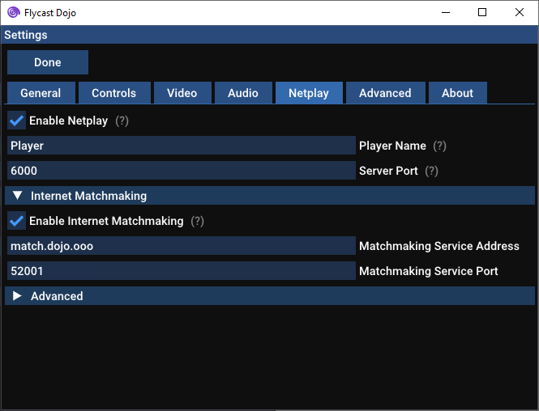
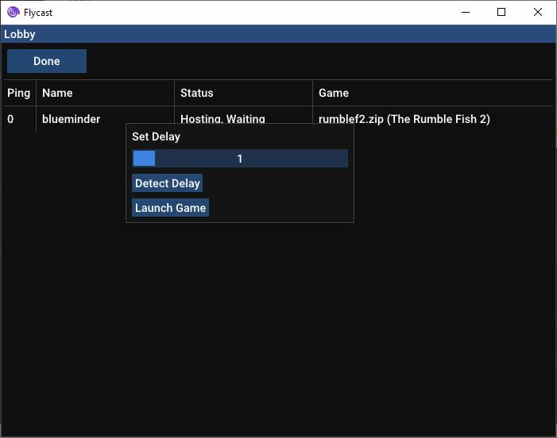
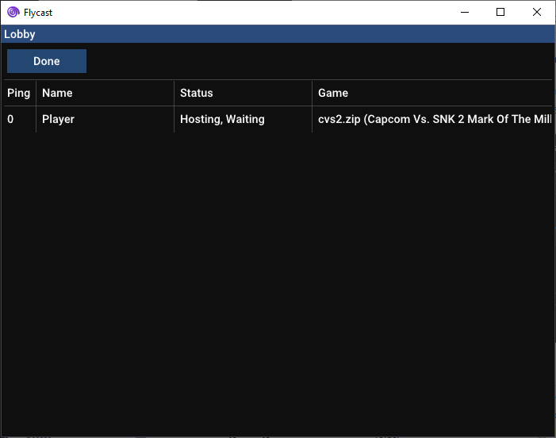
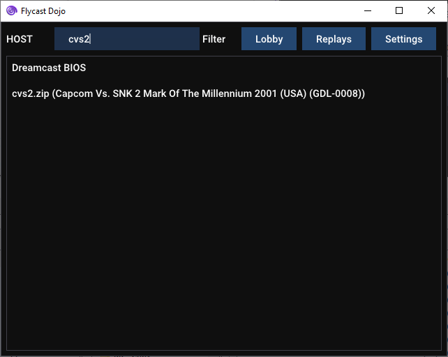
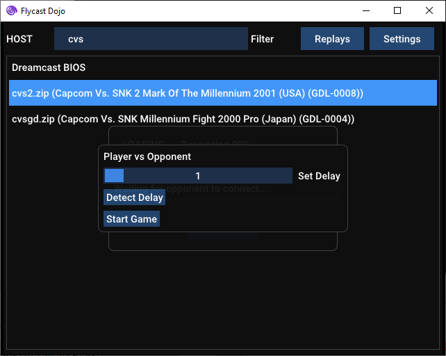
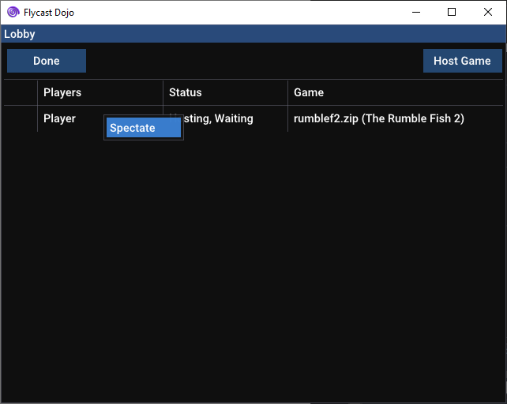

Flycast Dojo
===========
**Flycast Dojo** is a fork of [**Flycast**](https://github.com/flyinghead/flycast), a multi-platform Sega Dreamcast, Naomi and Atomiswave emulator derived from [**Reicast**](https://reicast.com/), with a focus on netplay features and replay. We intend to keep **Flycast Dojo** updated with the latest downstream changes made to the parent project.

**Flycast Dojo** can be retrieved standalone from GitHub, or as a part of the [Fightcade](https://www.fightcade.com/) matchmaking service. Either way you retrieve it, you will always have the option to use it alone for P2P games either over a virtual LAN, or through a direct connection.

General information about flycast configuration and supported features can be found on [**TheArcadeStriker's flycast wiki**](https://github.com/TheArcadeStriker/flycast-wiki/wiki)

# Getting Started
To get started with Flycast Dojo, make sure that you have the appropriate ROMs and BIOS files available in your ROM and data folders. At the time of writing, the preferred MAME romset for NAOMI & Atomiswave games is the **MAME 0.218** romset.

If you are running Fightcade, you can find the ROMs folder at `Fightcade\emulator\flycast\ROMS` while non-Fightcade users are free to create a `games` directory inside of the folder they installed Flycast, or point to any other directory on their computer as a **"Content Location"** in the settings.

For the sake of performance, it is advised that you keep your games and the emulator on the same drive.

If you are using the preferred romset, a BIOS is generally not necessary. If Flycast ends up asking you for a BIOS, be sure to add `awbios.zip` for Atomiswave games or `naomi.zip` for NAOMI games into your `data` directory in the folder you have Flycast installed. In your settings, the folder Flycast is installed in is your **"Home Directory"**.

If you plan on using the built-in LAN Lobby, make sure that your **"Content Location"** is set to wherever you are holding your ROMs.

For more information on verifying your BIOS files, you can head to the [Flycast wiki page](https://github.com/TheArcadeStriker/flycast-wiki/wiki/Verifying-your-BIOS-and-Arcade-ROMs) on the topic.


# Setting Controls
To set up your controls in Flycast, launch the emulator and head to **Settings -> Controls**. Set your controller of choice to **Port A**. From there, press **Map** to open the **Controller Mapping** menu.

Select the **Arcade button names** checkbox to show the arcade button mapping. Inputs recognized as buttons can be assigned on the left hand side of the screen while inputs recognized as Axes are mapped on the right hand side.

The following is a sample mapping for XInput (XBOX 360) Controllers created by **pokeshark** on the [Official Fightcade Discord](https://discord.com/invite/EyERRSg). Note that the the triggers are on the right hand side, corresponding with analog axes.


# Starting a Netplay Session
You can find the Netplay settings under the "Netplay" section of the emulator's settings:



## Lobby Quick Start
If you are connected to your opponents on a shared LAN or are using software that emulates local connections like ZeroTier or Radmin VPN, you can make your life easier by enabling lobbies.

* In the Netplay options, check "Enable Lobby" to make yourself visible to anyone connected to your network.
* Set a unique Player Name to distinguish yourself from the crowd.

### As Guest
* On the Lobby screen, click on any entries with the status of "Hosting, Waiting" to launch a game. The game will load, and the session will start once the host has selected delay.



### As Host
* In the Lobby screen, click "Host Game" and select your game of choice.


> Empty lobby with "Host Game" button highlighted


> Host game selection menu with search filter

#### Set Delay
When a guest joins a session, the host can set the delay according to packet round trip time by pressing **"Detect Delay"**. Use the slider to adjust the game to your liking, and press "Start Game" to begin your session.

Depending on the connection between you and your opponent and the tendency for network spikes, you may have to bump delay up to make your game smoother. The best course of action is to start low, and go higher until both you and your opponent have a smooth framerate.



### As Spectator
To spectate a match in your lobby, you will need to make a spectate request before a second player joins a match. Before spectating, make sure that you also have the same ROM as the players do.

Just right-click on any lobby game with the status of "Hosting, Waiting" and click on Spectate. From here, the game will start and pause until the match starts.

As of right now, spectating is limited to one person at a time. This should be handy for running tournaments online.



# Replays
To see a listing of your recorded replay sessions to play back, click on the "Replays" button on the Flycast main screen.

To record your netplay sessions, just check the box that says "Record All Sessions". This will create a new replay file for each netplay session you run and will be saved in the `replays/` subdirectory.

To play the replay file, just click on the corresponding entry, and the replay data will played back in its corresponding game.


## Manual Operation

### Set Server IP & Port
If you are hosting and do not wish to use the lobby system, you can enter your server details manually in the "Netplay" settings. Once you have specified your session details, make sure that your opponent enters your IP address and port specified.

If you are a guest, make sure that "Act As Server" is not checked and that you have entered the matching IP address and port of your opponent in the "Server" column.

#### Manual Delay Calculation
To calculate delay, we would use the following formula:

`Ceiling( Ping / 2 * FrameDuration (16 ms) ) = Delay #`

For instance, if my opponent’s average ping is 42 ms, I would divide it by 32 ms (2 * 16 ms) and round it up to 2.

```
= Ceiling( 42 ms / 2*16 ms )
= Ceiling( 42 ms / 32 ms )
= Ceiling( 1.3125 )
= 2
```

### Launch Game
On the Flycast main screen, you may now select your game of choice. You may also filter your list of games by typing in the text box on the top of the screen.

If you are hosting, you must start the game first, then have your opponent join afterward. If you are joining someone else's game, you must wait for them to start first. Be sure that you and your opponent have the same files before starting your session. These would include your ROM files, as well at your `eeprom.net`/`nvmem.net` files found in your `data/` subdirectory.

# Command Line
You may also call Flycast from the command line. All command line flags correspond with the options found in `emu.cfg`. Here are some example calls:

## Server
```flycast.exe -config dojo:Enable -config dojo:ActAsServer=yes -config dojo:ServerPort=6000 ControllerTest-DJ.cdi```

## Client
```flycast.exe -config dojo:Enable -config dojo:ActAsServer=no -config dojo:ServerIP=127.0.0.1 -config dojo:ServerPort=6000 ControllerTest-DJ.cdi```

## TCP Match Transmission (Spectating)
_append to server arguments_
```-config dojo:Transmitting=yes -config dojo:SpectatorIP=<IP> -config dojo:SpectatorPort=7000```

## TCP Match Receiving (Spectating)
```-config dojo:Receiving=yes -config dojo:SpectatorPort=7000```

## Test Game Screen
```-config dojo:TestGame=yes```

# Other Guides
[The Rumble Fish 2 Wiki - Netplay](https://wiki.gbl.gg/w/The_Rumble_Fish_2/Netplay)

# Video Demos
## Flycast Netplay Testing - Capcom vs SNK 2 (NAOMI) VS
[](http://www.youtube.com/watch?v=zZoonpVJRjI "Flycast Netplay Testing - Capcom vs SNK 2 (NAOMI) VS")

## Flycast Netplay Testing - Akatsuki Blitzkampf Ausf Achse (NAOMI) VS
[](http://www.youtube.com/watch?v=s0MXenZPLiU "Flycast Netplay Testing - Akatsuki Blitzkampf Ausf Achse (NAOMI) VS")

## Flycast Dojo - Spectating / TCP Transmission - Test 1
[](https://www.youtube.com/watch?v=AmRf7MwOrQA)

## Flycast Dojo - The Rumble Fish 2 (Atomiswave) - LAN Lobby Spectating Test 1
[](https://www.youtube.com/watch?v=U9Nexso4lpo)

# Roadmap
- [x] UDP Delay Netplay
- [x] UDP Spectating
- [x] Session Replays
- [x] LAN Lobbies
- [x] TCP Spectating
- [ ] Native Linux Support
    - Currently runs via Wine
    - Native build currently works sans spectating
- [ ] Offline Game Recording
- [ ] Offline Game Delay (Practice)
- [ ] Lua Scripting
