<p align="center">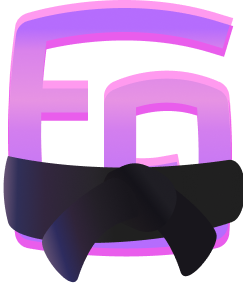<br /><i>Logo Credit: <a href="https://github.com/Foxlum">@Foxlum</a></i></p>
<h1 align="center">Flycast Dojo</h1>
 
**Flycast Dojo** is a fork of [**Flycast**](https://github.com/flyinghead/flycast), a multi-platform Sega Dreamcast, Naomi and Atomiswave emulator derived from [**Reicast**](https://reicast.com/), with a focus on netplay features and replay. We intend to keep **Flycast Dojo** updated with the latest downstream changes made to the parent project.

**Flycast Dojo** can be retrieved from GitHub, or as a part of the [Fightcade](https://www.fightcade.com/) matchmaking service. However you obtain it, you will always have the option to use it standalone for P2P games using Match Codes over an internet matchmaking server, through a direct IP connection, or a virtual LAN like ZeroTier or Radmin.

For quick start guides, frequently asked questions, online replays, and community links where you can find people to play against, head to the [Flycast Dojo](http://flycast.dojo.ooo/) site.

General information about Flycast configuration and supported features can be found on [TheArcadeStriker's flycast wiki](https://github.com/TheArcadeStriker/flycast-wiki/wiki)

For general emulator help and updates on Flycast Dojo, check out the **#netplay** room of the [Flycast Discord](https://discord.gg/X8YWP8w).

For Fightcade-specific help, be sure to read the pins and ask questions in the **#flycast-emulator** channel on the [Fightcade Discord](https://discord.gg/EyERRSg)

# Contents
- [Visual Aids](#visual-aids)
  * [Match Code Quick Start](#match-code-quick-start)
  * [Fightcade Quick Start](#fightcade-quick-start)
- [Getting Started](#getting-started)
- [Setting Controls](#setting-controls)
- [Starting a Netplay Session](#starting-a-netplay-session)
  * [Netplay Settings](#netplay-settings)
  * [Match Code Quick Start](#match-code-quick-start-1)
    + [As Host](#as-host)
      - [Set Delay](#set-delay)
    + [As Guest](#as-guest)
    + [Troubleshooting](#match-code-troubleshooting)
  * [Manual Operation](#manual-operation)
    + [Set Server IP & Port](#set-server-ip--port)
    + [Delay Calculation](#manual-delay-calculation)
    + [Launch Game](#launch-game)
    + [Manual Spectating](#manual-spectating)
      - [Transmitting](#transmitting)
      - [Receiving](#receiving)
- [Replays](#replays)
    + [Public Replay Servers & Transmitting Game Sessions](#public-replay-servers--transmitting-game-sessions)
- [Savestates](#savestates)
    + [Custom Savestates](#custom-savestates)
- [MD5 Checksum Calculation & Validation](#md5-checksum-calculation--validation)
- [Training Mode](#training-mode)
- [Linux Build](#linux-build)
- [Command Line](#command-line)
  * [Netplay](#netplay)
  * [Spectating](#spectating)
  * [Test Game Screen](#test-game-screen)
- [Game-specific Guides](#game-specific-guides)
- [Video Demos](#video-demos)
- [Roadmap](#roadmap)

# Visual Aids

## Match Code Quick Start


## Fightcade Quick Start
<a href="https://www.youtube.com/watch?v=47oJOUoGYmI"></a>

# Getting Started
To get started with Flycast Dojo, make sure that you have the appropriate ROMs and BIOS files available in your ROM and data folders. At the time of writing, the preferred MAME romset for NAOMI & Atomiswave games is the **MAME 0.226** romset.

If you are running Fightcade, you can find the ROMs folder at `Fightcade\emulator\flycast\ROMS` while non-Fightcade users can use the `ROMS` folder in the Flycast folder.

For the sake of performance, it is advised that you keep your games and the emulator on the same drive.

For the BIOS, be sure to add `awbios.zip` for Atomiswave games or `naomi.zip` for NAOMI games into your `data` directory in the folder you have Flycast installed. In your settings, the folder Flycast is installed in is your **"Home Directory"**.

For more information on verifying your BIOS files, you can head to the [Flycast wiki page](https://github.com/TheArcadeStriker/flycast-wiki/wiki/Verifying-your-BIOS-and-Arcade-ROMs) on the topic.

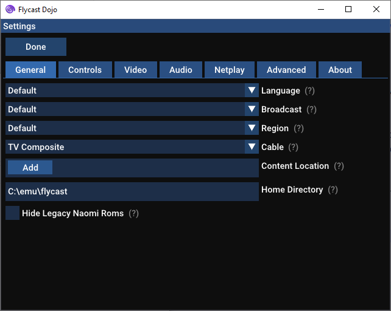

# Setting Controls
To set up your controls in Flycast, launch the emulator and head to **Settings -> Controls**. Set your controller of choice to **Port A**. From there, press **Map** to open the **Controller Mapping** menu.

Select the **Arcade button names** checkbox to show the arcade button mapping. Inputs recognized as buttons can be assigned on the left hand side of the screen while inputs recognized as Axes are mapped on the right hand side.

The following is a sample mapping for XInput (XBOX 360) Controllers created by **pokeshark** on the [Official Fightcade Discord](https://discord.com/invite/EyERRSg). Note that the triggers are on the right hand side of the screen, corresponding with analog axes.

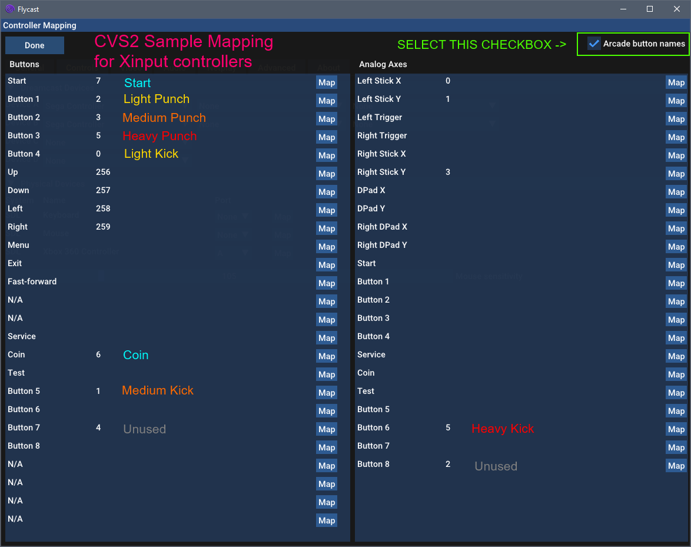

# Starting a Netplay Session

## Netplay Settings
You can find the Netplay settings under the **Dojo** section of the emulator's settings:

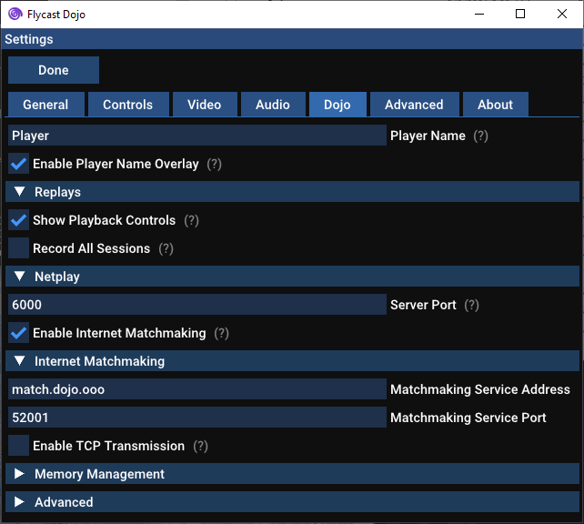

Match Codes are enabled by default, pointing to the default matchmaking relay. For manual operation (i.e., Command Line or External Lobbies) just disable the checkbox from **Enable Internet Matchmaking**, or pass `dojo:EnableMatchCode=no` to the command line options.

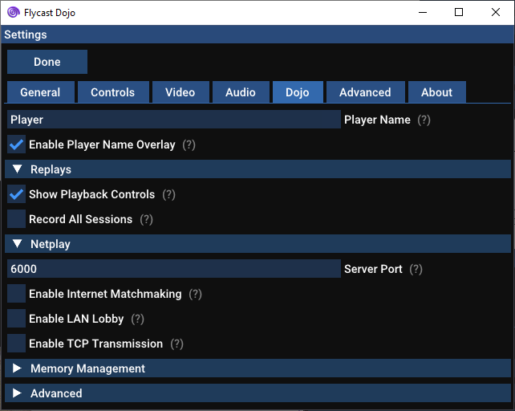

## Match Code Quick Start
Using Match Codes, Flycast Dojo can start a P2P game session behind firewalls, so that you can play against others without the need of Radmin or Fightcade. No need to sign up for any accounts or download additional software than Flycast Dojo itself. You should be able to play any games supported by Flycast, so long as you and your opponent have the same ROM.

The methods used by this feature should work with most consumer routers, but you may run into trouble over some cloud gaming services or corporate networks. (It is confirmed to work over Paperspace though, where I did much of my testing).

### As Host
You can set yourself as a host by making sure __HOST__ is selected in the drop-down box on the left, then click on the game to begin.

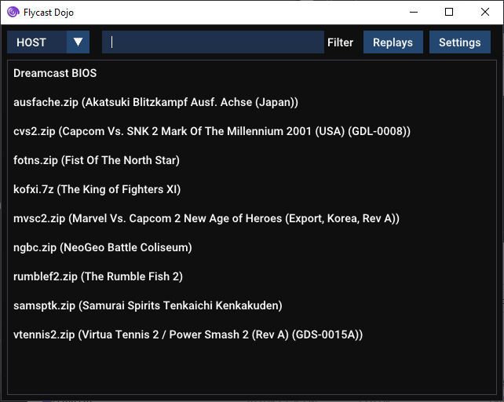

This will contact the default matchmaking relay and give you a code to send to your opponent. To make code transfer easier, press the __Copy Match Code__ button to add the code to your clipboard to paste to your opponent.

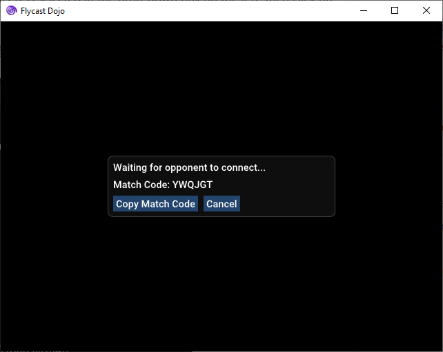

#### Set Delay
When a guest joins a session, the host can set the delay according to packet round trip time by pressing **"Detect Delay"**. Use the slider to adjust the game to your liking, and press "Start Game" to begin your session.

Depending on the connection between you and your opponent and the tendency for network spikes, you may have to bump delay up to make your game smoother. The best course of action is to start low, and go higher until both you and your opponent have a smooth framerate.

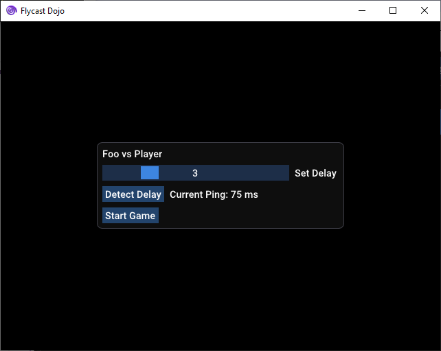

### As Guest
To join a game, click on the dropdown on the left and select __JOIN__ then select the game of your choice. It will prompt you for the match code. If you have copied the Match Code from your opponent, you can press the __Paste__ button, otherwise, you can enter in the match code manually.

Once you are done, you can press __Start Session__.

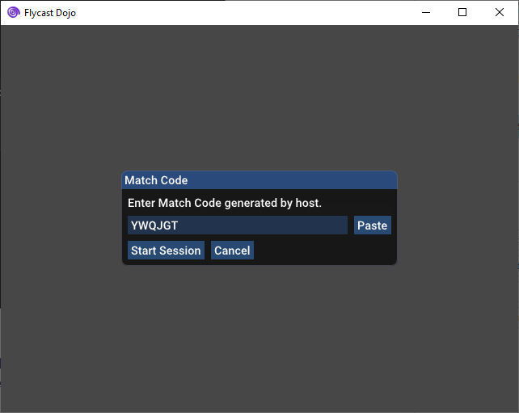

### Match Code Troubleshooting

If you notice disconnects at some regular interval (e.g. every 6 minutes, 10, minutes, 15 minutes), it may be possible that your router is closing the UDP route that was established by the matchmaking service by having a low UDP Timeout. This is similar to what can happen with VoIP calls on restrictive routers.

To fix this, find your router's **UDP Timeout** settings and set it to **90 seconds** or higher.  

If you are unable to find this setting, you can forward your router's port and [connect manually](#manual-operation), or use the [LAN Lobby](#lobby-quick-start) over a Virtual LAN service like ZeroTier or Radmin VPN.

For more information, check out [10 VoIP Problems: How to Fix Them Forever](https://www.nextiva.com/blog/voip-problems.html#s2).

# Manual Operation

## Set Server IP & Port
If you are hosting, you can enter your server details manually in the "Netplay" settings. Once you have specified your session details, make sure that your opponent enters your IP address and port specified.

If you are a guest, make sure that "Act As Server" is not checked and that you have entered the matching IP address and port of your opponent in the "Server" column.

## Manual Delay Calculation
To calculate delay, we would use the following formula:

`Ceiling( Ping / 2 * FrameDuration (16 ms) ) = Delay #`

For instance, if my opponent’s average ping is 42 ms, I would divide it by 32 ms (2 * 16 ms) and round it up to 2.

```
= Ceiling( 42 ms / 2*16 ms )
= Ceiling( 42 ms / 32 ms )
= Ceiling( 1.3125 )
= 2
```

## Launch Game
On the Flycast main screen, you may now select your game of choice. You may also filter your list of games by typing in the text box on the top of the screen.

If you are hosting, you must start the game first, then have your opponent join afterward. If you are joining someone else's game, you must wait for them to start first. Be sure that you and your opponent have the same files before starting your session. These would include your ROM files, as well at your `eeprom.net`/`nvmem.net` files found in your `data/` subdirectory.

## Manual Spectating

### Transmitting
To transmit your current game session or replays, go into the **Dojo** settings tab and press the checkbox by **Enable TCP Transmission**. You can edit your target spectator IP Address and Port.

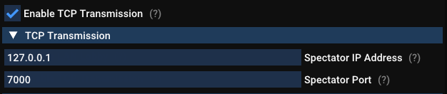

If you wish to enable transmitting when launching via the Command Line, just add ```-config dojo:Transmitting=yes -config dojo:SpectatorIP=<IP> -config dojo:SpectatorPort=7000``` to your command.

### Receiving
To launch as a spectating client via the Command Line and set your listening port, add ```-config dojo:Receiving=yes -config dojo:ActAsServer=no``` to your command.

To launch as a receiving server via the Command Line and set your listening port, add ```-config dojo:Receiving=yes  -config dojo:ActAsServer=yes -config dojo:SpectatorPort=7000``` to your command.

# Replays

To see a listing of your recorded replay sessions to play back, click on the "Replays" button on the Flycast main screen.

To record your netplay sessions, just check the box that says "Record All Sessions". This will create a new replay file for each netplay session you run and will be saved in the `replays/` subdirectory.

To play the replay file, just click on the corresponding entry, and the replay data will played back in its corresponding game.

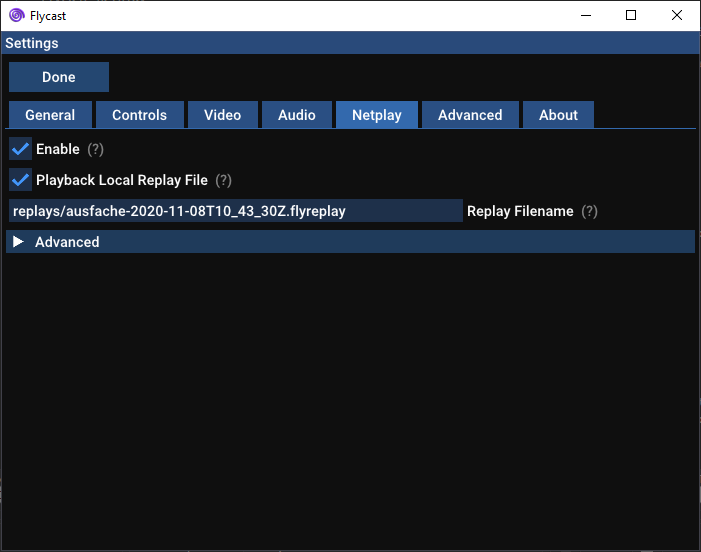

## Public Replay Servers & Transmitting Game Sessions

If you wish to share your game sessions, there is an option to transmit to any replay server or to any listening spectator with the **RECEIVE** option set.

There is currently an experimental public replay server available at **match.dojo.ooo**. The server accepts transmissions at port **7000**, with an interface to search and download replays at [http://match.dojo.ooo:8000/replays](http://match.dojo.ooo:8000/replays).

**Transmitting to Replay Server**

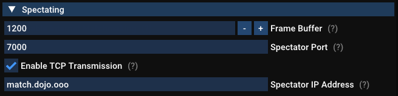

**Replay Server Search Interface**

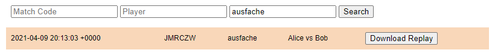

Once some code cleanup and quality checks are done, the replay server will be made available in its own repository for anyone to be able to host themselves.

# Savestates
During a netplay match, if a custom savestate is present, you can "jump" to a starting savestate by pressing the **Backspace** button by default. This may be edited in the Control mapping section of the Settings.

## Custom Savestates
To use custom savestates, you must first disable **Ignore Netplay Savestates** in the **Memory Management** section of your Dojo settings.

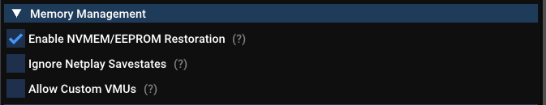

From here, you must rename your desired game savestate to be `[ROM Name].state.net` and replace the existing file in your `data/` folder. Be sure you and your opponent have the same files when you start a session, or else you will be looking at different game states entirely.

# MD5 Checksum Calculation & Validation
In order for netplay to work, both you and your opponent must have the same ROM on both computers. Players using different ROM variants can lead to desyncing. Oftentimes, verifying the validity of ROMs can be a pain, leading folks to reacquire them unnecessarily in a game of guess and check. To solve this issue,  MD5 checksum calculation and validation has been made available.

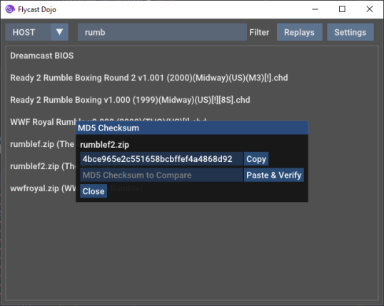

To access this, just right click on any ROM name, and click "Calculate MD5 Checksum". A dialog will pop up showing the MD5 checksum of the selected ROM, and a button to easily copy it to the clipboard to share with your opponent.

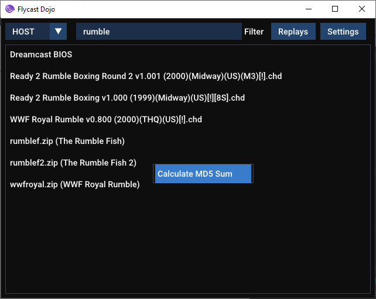

To verify that you have the same ROM as your opponent, just copy the MD5 checksum given to you, and click the "Paste & Verify" button. If your ROMs match, you'll see a green "Verified!" by the Close button. If the hashes do not match, it will say "Mismatch." in red.

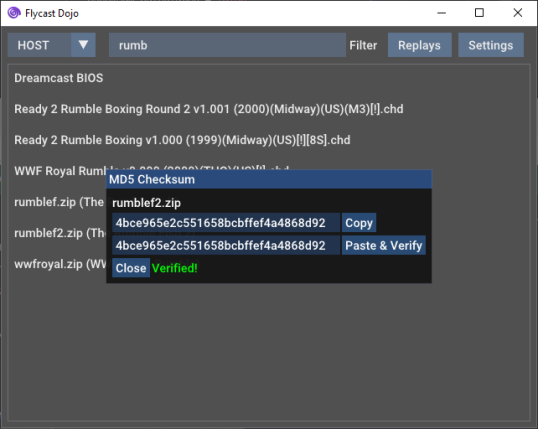

If a `flycast_roms.json` file is found, it should contain a listing of MD5 checksums for approved ROMs between users. This format is intended for communities to share common ROM metadata between users to ensure that everyone has the same files.

If your ROM is found in this file, the MD5 Checksum window will say *"Validation File Match"*. So long as you see this, you should be good to go!

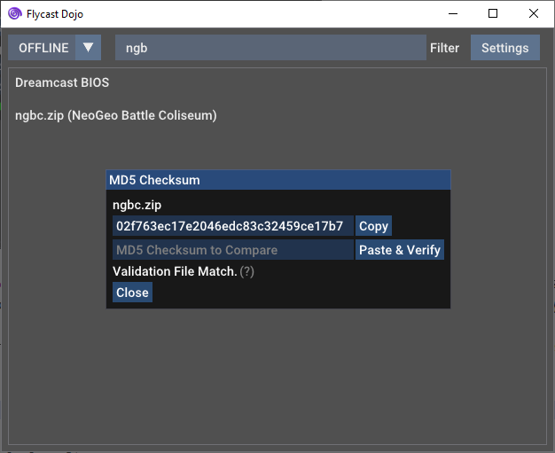

# Training Mode

With the new Training Mode, you can enable game cheats while playing offline using RetroArch's `.cht` file format to adjust game parameters, quickly load states, save states, record, and play back user inputs for practice on any supported Dreamcast, NAOMI, or Atomiswave game. You can enter Training mode by selecting the **TRAIN** option in the drop-down menu on the top left of the Flycast main menu.

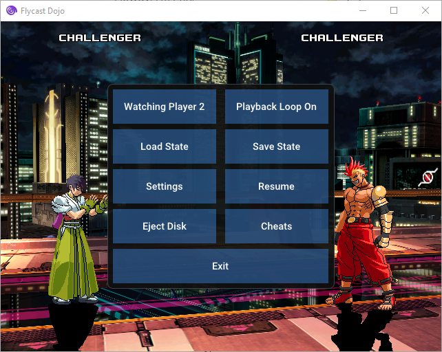

To specify which player is being controlled and recorded, just press the **F7** key or press the **Menu** button (TAB by default) and click on "Watching Player". Player 1 corresponds with Port A, while Player 2 corresponds with Port B. To set playback loop settings, hit the **Menu** button and click on "Playback Loop Off" (or "On").

To record inputs, hit **F1**, and hit it again to stop recording. To play back the input, press **F4**. If the Playback Loop is enabled, the input will be repeated until the Play button is hit again. If it is disabled, playback will be invoked on demand. You also have two more slots to record on **F2** and **F3**, with playback on **F5**, and **F6**. To play a random input slot from the ones you have recorded, just hit the **F10** button.

To save your current game state, hit, **F8** and to quickly load it again, hit **F9**.

All of the Training Mode controls can be assigned to any keyboard key or gamepad input in the Controls settings.

Defaults:
* **F1-F3** Record Slots
* **F4-F6** Play Slots
* **F7** One-Button Player Change
* **F8** Quick Save
* **F9** Quick Load

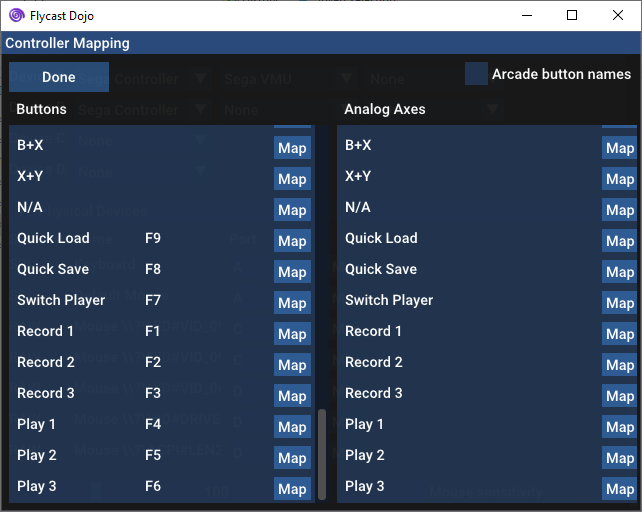

# Linux Build
Flycast Dojo is currently available as a `tar.gz` archive containing a 64-bit x86 binary `flycast.elf`. It can run self-contained from the same directory, with all user configurations and relevant game metadata kept in the same place. It has been tested to run on **Ubuntu 20.04**, as well as **Arch Linux 2021.04.01**. So long as you have the dependencies installed, you should be able to run `tar zxvf linux-flycast-dojo-*.tar.gz`, enter the directory, and start using it immediately.

The following are the relevant dependencies:

* **Ubuntu 20.04** Dependencies
  * `libcurl3-gnutls`
  * `libzip5`
  * `libminiupnpc17`
  * `liblua5.3`
* **Arch Linux** Dependencies
  * `libcurl3-gnutls`
  * `libzip`
  * `miniupnpc`
  * `lua53`

If you still get an error after installing Lua, try creating a symbolic link to the locally installed version of liblua to the expected path:

`ln -s <liblua.so location> /app/lib/liblua5.3.so.0`

# Command Line
You may also call Flycast from the command line. All command line flags correspond with the options found in `emu.cfg`. Here are some example calls:

## Netplay
 * Server (Without Match Codes)

```flycast.exe -config network:GGPO=yes -config dojo:EnableMatchCode=no -config network:ActAsServer=yes -config network:server=127.0.0.1 -config network:GGPOPort=6000 -config network:GGPORemotePort=6001 -config dojo:PlayerName=Player1 ControllerTest-DJ.cdi```

*  Client (Without Match Codes)

```/flycast.exe -config network:GGPO=yes -config dojo:EnableMatchCode=no -config network:ActAsServer=no -config network:server=127.0.0.1 -config network:GGPOPort=6001 -config network:GGPORemotePort=6000 -config dojo:PlayerName=Player2 ControllerTest-DJ.cdi```

## Spectating
 * TCP Match Transmission (Spectating)

_append to server arguments_

```-config dojo:Transmitting=yes -config dojo:SpectatorIP=<IP> -config dojo:SpectatorPort=7000```

 * TCP Match Receiving

```-config dojo:Receiving=yes -config dojo:SpectatorPort=7000 -config:DojoActAsServer=yes```

## Test Game Screen

```-config dojo:TestGame=yes```

# Game-specific Guides
 * [The Rumble Fish 2 Wiki - Netplay](https://wiki.gbl.gg/w/The_Rumble_Fish_2/Netplay)
 * [Akatsuki Blitzkampf Wiki - Netplay](https://wiki.gbl.gg/w/Akatsuki_Blitzkampf/Netplay)

# Video Demos
## Flycast Netplay Testing - Capcom vs SNK 2 (NAOMI) VS
<a href="http://www.youtube.com/watch?v=zZoonpVJRjI"></a>

## Flycast Netplay Testing - Akatsuki Blitzkampf Ausf Achse (NAOMI) VS
<a href="http://www.youtube.com/watch?v=s0MXenZPLiU"></a>

## Flycast Dojo - Spectating / TCP Transmission - Test 1
<a href="https://www.youtube.com/watch?v=AmRf7MwOrQA"></a>

## Flycast Dojo - The Rumble Fish 2 (Atomiswave) - LAN Lobby Spectating Test 1
<a href="https://www.youtube.com/watch?v=U9Nexso4lpo"></a>

# Roadmap
- [x] UDP Delay Netplay
- [x] UDP Spectating
- [x] Session Replays
- [ ] LAN Lobbies (currently being overhauled)
- [x] TCP Spectating
- [x] Offline Game Recording
- [x] Offline Game Delay (Practice)
- [x] Training Mode
- [x] Native Linux Support
- [x] Native Mac OS Support
- [x] Lua Scripting (Introduced upstream)
