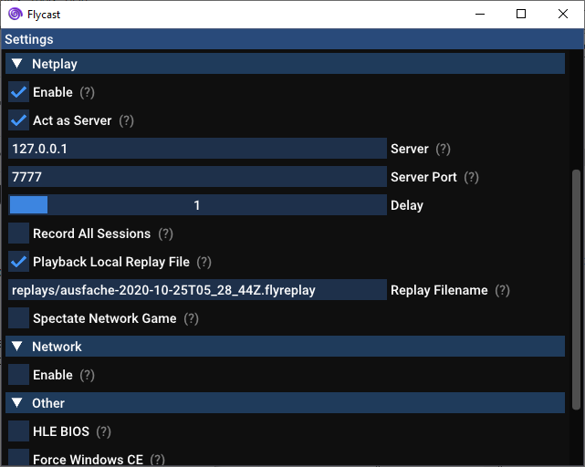

flycast-netplay
===========
**flycast-netplay** is a fork of [**flycast**](https://github.com/flyinghead/flycast), multi-platform Sega Dreamcast, Naomi and Atomiswave emulator derived from [**reicast**](https://reicast.com/), with a focus on netplay features and replay. We intend to keep **flycast-netplay** updated with the latest downstream changes made to the parent project.

General information about flycast configuration and supported features can be found on [**TheArcadeStriker's flycast wiki**](https://github.com/TheArcadeStriker/flycast-wiki/wiki)

# Starting a Netplay Session
You can find the Netplay settings under the "Advanced" section of the emulator's settings:


## Set Server IP & Port
A text box is present for server IP. If you are hosting a game, check the "Act As Server" box and make sure that your opponent enters your IP address and port specified.

If you are a guest, make sure that "Act As Server" is not checked and that you have entered the matching IP address and port of your opponent in the "Server" column.

## Set Delay
There's a slider for delay.

To calculate delay, we would use the following formula:

`Ceiling( Ping / 2 * FrameDuration (16 ms) ) = Delay #`

For instance, if my opponent’s average ping is 42 ms, I would divide it by 32 ms (2 * 16 ms) and round it up to 2.

```
= Ceiling( 42 ms / 2*16 ms )
= Ceiling( 42 ms / 32 ms )
= Ceiling( 1.3125 )
= 2
```

Make sure both you and your opponent have the same delay and game ROM to begin your game.

In the future, this will be calculated automatically. Lobby systems will also be available so you won’t have to manually enter IP addresses every time. In the meantime, this is the cross we bear to test the future.

## Launch Game
On the Flycast main screen, you may now select your game of choice. You may also filter your list of games by typing in the text box on the top of the screen.

If you are hosting, you must start the game first, then have your opponent join afterward. If you are joining someone else’s game, you must wait for them to start first. Be sure that you and your opponent have the same files before starting your session. These would include your ROM files, as well at your `save.net` files found in your `data/` subdirectory.

# Replays
To record your netplay sessions, just check the box that says "Record All Sessions". This will create a new replay file for each netplay session you run and will be saved in the `replays/` subdirectory.

To play the replay file, be sure to uncheck "Record All Sessions" and enable "Playback Local Replay File". The file representing your last session is automatically populated in the "Replay Filename" column by default.



# Command Line
You may also call Flycast from the command line. All command line flags correspond with the options found in `emu.cfg`. Here are some example calls:

### Server
```flycast.exe -config maplenet:Enable -config maplenet:ActAsServer=yes -config maplenet:ServerPort=7777 -config maplenet:Delay=1 C:\emu\flycast\games\dc\ControllerTest-DJ.cdi```

### Client
```flycast.exe -config maplenet:Enable -config maplenet:ActAsServer=no -config maplenet:ServerIP=127.0.0.1 -config maplenet:ServerPort=7777 -config maplenet:Delay=1 C:\emu\flycast\games\dc\ControllerTest-DJ.cdi```

## Video Demos
### Flycast Netplay Testing - Capcom vs SNK 2 (NAOMI) VS
[](http://www.youtube.com/watch?v=zZoonpVJRjI "Flycast Netplay Testing - Capcom vs SNK 2 (NAOMI) VS")

### Flycast Netplay Testing - Akatsuki Blitzkampf Ausf Achse (NAOMI) VS
[](http://www.youtube.com/watch?v=s0MXenZPLiU "Flycast Netplay Testing - Akatsuki Blitzkampf Ausf Achse (NAOMI) VS")

# Roadmap
- [x] UDP Delay Netplay
- [x] Network Match Streaming
- [x] Session Replays
- [ ] Linux Support (Partially Implemented)
- [ ] Offline Game Recording
- [ ] Offline Game Delay (Practice)
- [ ] Lua Scripting
